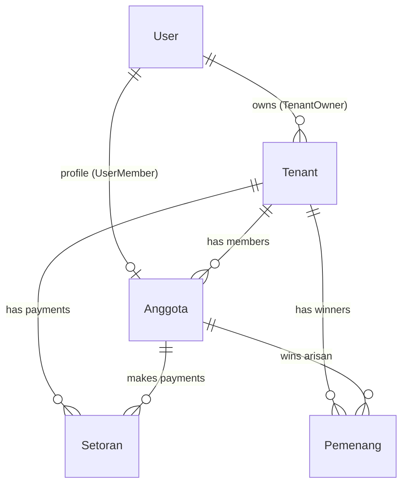
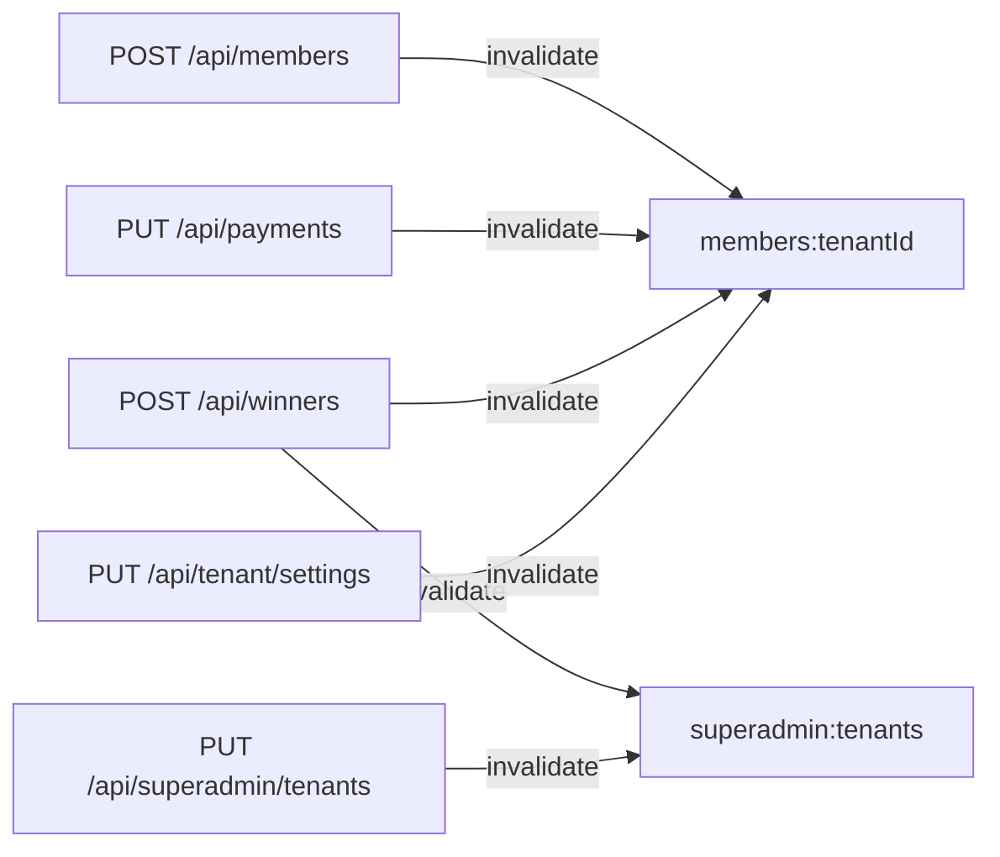
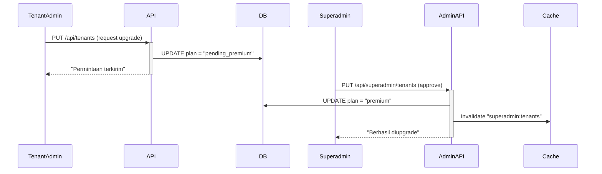
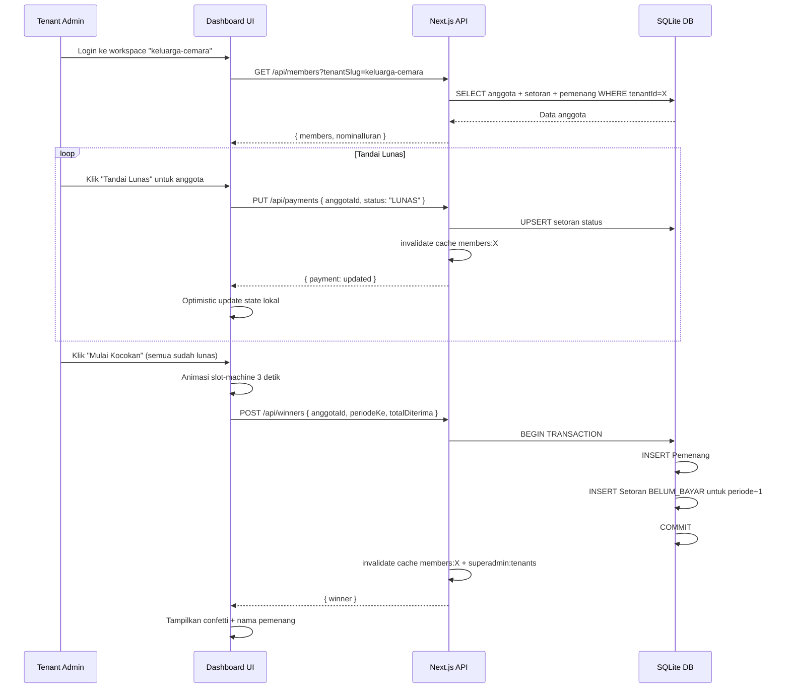

# Lotre — Dokumentasi Teknis Lengkap

> Panduan pengembang untuk platform SaaS Manajemen Arisan Digital.  
> Terakhir diperbarui: Mei 2026

---

## Daftar Isi

1. [Gambaran Umum Sistem](#1-gambaran-umum-sistem)
2. [Stack Teknologi](#2-stack-teknologi)
3. [Struktur Direktori](#3-struktur-direktori)
4. [Arsitektur Sistem](#4-arsitektur-sistem)
5. [Database Schema](#5-database-schema)
6. [Modul Inti (`src/lib`)](#6-modul-inti-srclib)
7. [API Routes](#7-api-routes)
8. [Halaman & Komponen UI](#8-halaman--komponen-ui)
9. [Autentikasi & Otorisasi](#9-autentikasi--otorisasi)
10. [Multi-Tenancy](#10-multi-tenancy)
11. [Sistem Caching](#11-sistem-caching)
12. [Fitur Bisnis Utama](#12-fitur-bisnis-utama)
13. [Panduan Pengembangan](#13-panduan-pengembangan)
14. [Variabel Lingkungan](#14-variabel-lingkungan)
15. [Alur Kerja Lengkap](#15-alur-kerja-lengkap)

---

## 1. Gambaran Umum Sistem

**Lotre** adalah platform SaaS (**Software-as-a-Service**) berbasis web untuk mengelola kegiatan **arisan** (kelompok tabungan bergilir komunitas Indonesia) secara digital, transparan, dan modern.

### Tujuan Bisnis

| Segmen | Deskripsi |
|--------|-----------|
| **Tenant (Pengguna)** | Admin kelompok arisan — mendaftar, membuat workspace, mengelola anggota & undian |
| **Superadmin** | Pemilik platform — memantau seluruh tenant, menyetujui upgrade premium, menangguhkan akun |

### Konsep Kunci

- Satu akun user bisa memiliki **banyak kelompok arisan (workspace/tenant)**
- Setiap tenant terisolasi secara data (tidak bisa melihat data tenant lain)
- Paket **Free** dan **Premium** dengan proses upgrade manual disetujui Superadmin
- Kocokan undian dilakukan **secara digital** dengan animasi slot-machine

---

## 2. Stack Teknologi

| Lapisan | Teknologi | Versi |
|---------|-----------|-------|
| Framework | **Next.js** (App Router) | 16.2.6 |
| UI | **React** | 19.2.4 |
| Styling | **Vanilla CSS** (glassmorphism dark-mode) | — |
| Database | **SQLite** via Prisma ORM | — |
| ORM | **Prisma Client** | 5.22.0 |
| Autentikasi | **NextAuth.js** (Credentials Provider) | 4.24.11 |
| Runtime | **Node.js** | — |
| Bahasa | **TypeScript** | 5.x |

> **Catatan SQLite:** Deployment saat ini menggunakan SQLite yang cocok untuk skala kecil-menengah. Migrasi ke PostgreSQL dapat dilakukan dengan mengganti `provider` di `prisma/schema.prisma` dan memperbarui `DATABASE_URL`.

---

## 3. Struktur Direktori

```
lotre/
├── implementation/          ← 📁 Dokumentasi teknis (folder ini)
│   ├── README.md            ← Dokumen utama ini
│   ├── rancangan_sistem.md  ← Rancangan awal sistem (desain & konsep)
│   ├── api_reference.md     ← Referensi lengkap semua API endpoint
│   ├── database_schema.md   ← Diagram & deskripsi skema database
│   └── ui_components.md     ← Panduan UI, Desain Sistem, & Responsivitas Mobile
│
├── prisma/
│   ├── schema.prisma        ← Definisi model database
│   ├── seed.ts              ← Data awal (seed) untuk development
│   └── migrations/          ← Riwayat migrasi skema
│
├── src/
│   ├── middleware.ts         ← Guard autentikasi + subdomain routing
│   ├── lib/
│   │   ├── db.ts            ← Singleton Prisma Client
│   │   ├── tenant.ts        ← Resolusi tenantId dari request
│   │   └── cache.ts         ← In-memory TTL cache (server-side)
│   │
│   └── app/
│       ├── globals.css       ← Design system & CSS utility classes
│       ├── layout.tsx        ← Root layout + font loading
│       ├── page.tsx          ← Dashboard utama tenant (halaman terbesar)
│       ├── providers.tsx     ← SessionProvider wrapper
│       ├── auth/
│       │   ├── layout.tsx    ← Layout halaman auth (centered card)
│       │   ├── login/        ← Halaman login
│       │   └── register/     ← Halaman registrasi tenant baru
│       ├── superadmin/
│       │   └── page.tsx      ← Panel kontrol Superadmin
│       └── api/
│           ├── auth/
│           │   ├── [...nextauth]/route.ts  ← NextAuth handler + JWT config
│           │   └── register/route.ts       ← Registrasi akun baru
│           ├── members/
│           │   ├── route.ts                ← CRUD anggota
│           │   └── import/route.ts         ← Import massal CSV
│           ├── payments/route.ts           ← Toggle status iuran
│           ├── winners/route.ts            ← Catat pemenang undian
│           ├── tenants/route.ts            ← Kelola workspace tenant
│           ├── tenant/settings/route.ts    ← Pengaturan iuran per tenant
│           ├── superadmin/tenants/route.ts ← Admin: kelola semua tenant
│           ├── export/route.ts             ← Ekspor data JSON
│           └── backfill/route.ts           ← Backfill riwayat pemenang lama
│
└── public/                  ← Aset statis (gambar, dll.)
```

---

## 4. Arsitektur Sistem

### Diagram Alur Request

```mermaid
graph TD
    Browser -->|HTTP Request| Middleware[src/middleware.ts]
    
    Middleware -->|/superadmin/*| Guard{Cek JWT Role}
    Guard -->|Role: SUPERADMIN| SuperadminPage[superadmin/page.tsx]
    Guard -->|Bukan SUPERADMIN| Redirect[/auth/login]
    
    Middleware -->|subdomain.lotre.com| Rewrite[Rewrite /_tenants/slug/...]
    Middleware -->|Request biasa| App[Next.js App Router]
    
    App --> PageTSX[page.tsx - Dashboard Tenant]
    App --> APIRoutes[/api/* routes]
    
    APIRoutes --> LibTenant[lib/tenant.ts - Resolve tenantId]
    APIRoutes --> LibCache[lib/cache.ts - TTL Cache]
    LibCache -->|Cache miss| LibDB[lib/db.ts - Prisma Client]
    LibDB --> SQLite[(SQLite Database)]
```

### Pola Keamanan Data Multi-Tenant

Setiap query ke database **wajib** mengandung filter `tenantId`. Isolasi ini dijaga oleh:

1. `resolveTenantId()` di `src/lib/tenant.ts` — memvalidasi kepemilikan tenant
2. Setiap API route memanggil `resolveTenantId` sebelum query apapun
3. Prisma schema menggunakan Cascade Delete sehingga data terhapus bersih saat tenant dihapus

---

## 5. Database Schema

### Model Relationship



### Tabel: `User`

| Field | Tipe | Keterangan |
|-------|------|------------|
| `id` | `String` UUID | Primary Key |
| `email` | `String` UNIQUE | Email login |
| `passwordHash` | `String` | bcrypt hash |
| `namaLengkap` | `String` | Nama tampilan |
| `role` | `String` | `"SUPERADMIN"` \| `"TENANT_ADMIN"` \| `"MEMBER"` |
| `createdAt` | `DateTime` | Auto timestamp |

### Tabel: `Tenant` (Kelompok Arisan / Workspace)

| Field | Tipe | Keterangan |
|-------|------|------------|
| `id` | `String` UUID | Primary Key |
| `namaGrup` | `String` | Nama kelompok arisan |
| `slug` | `String` UNIQUE | Subdomain identifier (e.g., `keluarga-cemara`) |
| `plan` | `String` | `"free"` \| `"premium"` \| `"pending_premium"` |
| `nominalIuran` | `Float` | Nominal iuran per periode (default: 200.000) |
| `status` | `String` | `"ACTIVE"` \| `"SUSPENDED"` |
| `suspendReason` | `String?` | Alasan penangguhan (opsional) |
| `ownerId` | `String` FK | Merujuk ke `User.id` (Cascade Delete) |

> **`pending_premium`** adalah status transisi saat tenant mengajukan upgrade dan menunggu approval Superadmin.

### Tabel: `Anggota` (Member Arisan)

| Field | Tipe | Keterangan |
|-------|------|------------|
| `id` | `String` UUID | Primary Key |
| `tenantId` | `String` FK | Isolasi data per kelompok |
| `nama` | `String` | Nama lengkap anggota |
| `whatsapp` | `String` | Nomor kontak |
| `status` | `String` | `"ACTIVE"` \| `"INACTIVE"` |
| `userId` | `String?` UNIQUE | Link ke akun User (opsional) |

**Index Database:**
- `(tenantId, id)` — untuk query anggota spesifik dalam tenant
- `(tenantId, status)` — untuk filter anggota aktif saat kocokan

### Tabel: `Setoran` (Pembayaran Iuran)

| Field | Tipe | Keterangan |
|-------|------|------------|
| `id` | `String` UUID | Primary Key |
| `tenantId` | `String` FK | Isolasi data |
| `anggotaId` | `String` FK | Merujuk ke `Anggota.id` |
| `periodeKe` | `Int` | Putaran ke-berapa (1, 2, 3, ...) |
| `nominal` | `Float` | Jumlah iuran |
| `status` | `String` | `"LUNAS"` \| `"BELUM_BAYAR"` |
| `tanggalBayar` | `DateTime?` | Null jika belum bayar |

**Index Database:**
- `(tenantId, anggotaId)` — audit pembayaran per anggota
- `(tenantId, periodeKe)` — laporan per periode

### Tabel: `Pemenang` (Riwayat Undian)

| Field | Tipe | Keterangan |
|-------|------|------------|
| `id` | `String` UUID | Primary Key |
| `tenantId` | `String` FK | Isolasi data |
| `anggotaId` | `String` FK | Pemenang |
| `periodeKe` | `Int` | Periode undian |
| `tanggalMenang` | `DateTime` | Otomatis saat pencatatan |
| `totalDiterima` | `Float` | Total kas yang diterima |

**Index Database:**
- `(tenantId, anggotaId)` — cek apakah anggota pernah menang
- `(tenantId, periodeKe)` — cek pemenang per periode

---

## 6. Modul Inti (`src/lib`)

### `lib/db.ts` — Prisma Client Singleton

```typescript
// Pattern: globalThis singleton mencegah koneksi dobel di Next.js dev hot-reload
const db = globalThis.prismaGlobal ?? prismaClientSingleton();
export default db;
if (process.env.NODE_ENV !== "production") globalThis.prismaGlobal = db;
```

**Gunakan:** `import db from "@/lib/db"` di semua server-side code.

---

### `lib/tenant.ts` — Resolusi Tenant

Fungsi utama yang **harus dipanggil di setiap API route** sebelum query database.

#### `resolveTenantId(tenantSlug?)`

**Prioritas resolusi:**
1. Jika `tenantSlug` diberikan → cari `Tenant` by slug, validasi kepemilikan via session
2. Jika tidak ada slug → gunakan `session.user.tenantId` (session login)
3. Kembalikan `null` jika tidak bisa diresolved

```typescript
// Contoh penggunaan di API route
const tenantId = await resolveTenantId(searchParams.get("tenantSlug"));
if (!tenantId) return NextResponse.json({ error: "Tenant tidak ditemukan." }, { status: 400 });
// Aman: query dengan tenantId sudah tervalidasi
const members = await db.anggota.findMany({ where: { tenantId } });
```

> ⚠️ **Penting:** Fungsi ini membaca session NextAuth. Tidak perlu memanggil `getServerSession` secara terpisah di API route yang sudah menggunakan `resolveTenantId`.

#### `resolveTenant(tenantSlug?)`

Sama seperti `resolveTenantId` tapi mengembalikan objek `{ id, slug }` — digunakan di endpoint export.

---

### `lib/cache.ts` — In-Memory TTL Cache

Cache server-side berbasis `Map` dengan TTL (Time-To-Live). Digunakan untuk mengurangi query database berulang.

#### API

```typescript
import { apiCache } from "@/lib/cache";

// Baca (null jika miss atau kadaluarsa)
const data = apiCache.get<MyType>("cache:key");

// Tulis dengan TTL 30 detik
apiCache.set("cache:key", data, 30_000);

// Hapus satu key (saat ada mutasi)
apiCache.invalidate("cache:key");

// Hapus semua key dengan prefix
apiCache.invalidatePattern("members:");
```

#### Cache Keys yang Digunakan

| Key | TTL | Diinvalidasi oleh |
|-----|-----|-------------------|
| `members:{tenantId}` | 30 detik | `POST /api/members`, `PUT /api/payments`, `POST /api/winners`, `PUT /api/tenant/settings` |
| `superadmin:tenants` | 30 detik | `PUT /api/superadmin/tenants`, `POST /api/winners` |

> **Catatan Skalabilitas:** Cache ini hidup di memori proses Node.js yang sama. Untuk deployment multi-server (load balancer), perlu diganti dengan Redis atau cache terdistribusi lainnya.

---

## 7. API Routes

### Ringkasan Semua Endpoint

| Method | Path | Auth | Deskripsi |
|--------|------|------|-----------|
| `POST` | `/api/auth/register` | ❌ | Daftar akun tenant baru |
| `POST` | `/api/auth/[...nextauth]` | ❌ | NextAuth handler (login/logout) |
| `GET` | `/api/members?tenantSlug=` | ✅ | Ambil anggota + nominal iuran |
| `POST` | `/api/members` | ✅ | Tambah anggota baru |
| `POST` | `/api/members/import` | ✅ | Import massal anggota (maks 500) |
| `PUT` | `/api/payments` | ✅ | Toggle status iuran LUNAS/BELUM_BAYAR |
| `POST` | `/api/winners` | ✅ | Catat pemenang + seed setoran periode berikutnya |
| `GET` | `/api/tenants` | ✅ | Daftar workspace milik user yang login |
| `POST` | `/api/tenants` | ✅ | Buat workspace baru |
| `PUT` | `/api/tenants` | ✅ | Ajukan upgrade ke premium (→ pending_premium) |
| `PUT` | `/api/tenant/settings` | ✅ | Update nominalIuran (atomic update semua setoran) |
| `GET` | `/api/export?tenantSlug=` | ✅ | Ekspor data JSON (download file) |
| `POST` | `/api/backfill` | ✅ | Backfill riwayat pemenang lama |
| `GET` | `/api/superadmin/tenants` | 🔐 SUPER | Semua tenant + statistik global |
| `PUT` | `/api/superadmin/tenants` | 🔐 SUPER | Approve premium / suspend tenant |

**Legend:** ✅ = TENANT_ADMIN session required | 🔐 SUPER = SUPERADMIN session required

---

### Detail API Penting

#### `POST /api/auth/register`

Membuat akun baru + workspace pertama dalam satu request.

```typescript
// Request Body
{
  namaLengkap: string,
  email: string,
  password: string,      // min 8 karakter
  namaGrup: string,      // nama workspace pertama
  slug: string           // subdomain identifier
}

// Response 201
{
  success: true,
  message: "...",
  userId: string
}
```

---

#### `GET /api/members?tenantSlug={slug}`

```typescript
// Response 200
{
  members: [{
    id: string,
    name: string,           // dari Anggota.nama
    whatsapp: string,
    status: "lunas" | "belum-bayar",  // dihitung dari Setoran aktif
    hasWon: boolean,        // true jika ada record di Pemenang
    payments: Setoran[],
    winners: Pemenang[]
  }],
  nominalIuran: number
}
```

> **Catatan Transformasi:** Field `status` ("lunas"/"belum-bayar") adalah transformasi dari `Setoran.status` ("LUNAS"/"BELUM_BAYAR") yang dilakukan di API route, bukan di database.

---

#### `POST /api/winners` — Catat Pemenang (Atomic Transaction)

Satu-satunya endpoint yang melakukan **transaksi berantai** paling kompleks:

```typescript
// Dalam satu $transaction:
// 1. Buat record Pemenang baru
// 2. Ambil semua anggota ACTIVE di tenant
// 3. Buat Setoran BELUM_BAYAR untuk SEMUA anggota di periode berikutnya
// 4. Invalidate cache members:{tenantId} dan superadmin:tenants
```

> Ini memastikan data setoran periode berikutnya langsung tersedia setelah kocokan selesai.

---

#### `PUT /api/superadmin/tenants` — Admin Actions

```typescript
// Request Body: Setujui Premium
{ tenantId: string, action: "togglePlan", plan: "premium" }

// Request Body: Tolak / Downgrade ke Free
{ tenantId: string, action: "togglePlan", plan: "free" }

// Request Body: Suspend Tenant
{ tenantId: string, action: "toggleStatus", status: "SUSPENDED", suspendReason?: string }

// Request Body: Aktifkan Kembali
{ tenantId: string, action: "toggleStatus", status: "ACTIVE" }
```

---

## 8. Halaman & Komponen UI

> 💡 **Panduan UI & Responsivitas Khusus:** Seluruh detail mengenai token desain, global UI components (glass-card, button, badge), sistem table stacking mobile, bottom-sheet modal, dan persistent local storage didokumentasikan secara terpisah di **[ui_components.md](file:///Users/mm/Product/lotre/lotre/implementation/ui_components.md)**.

### `src/app/page.tsx` — Dashboard Tenant Utama

File terbesar (~2500+ baris). Menangani:

| Fitur | State Utama | API yang Dipanggil |
|-------|-------------|---------------------|
| Workspace switcher | `activeWorkspace`, `userWorkspaces` | `GET /api/tenants` |
| Persistence workspace | `localStorage` | — |
| Daftar anggota | `members` | `GET /api/members?tenantSlug=` |
| Pencarian anggota | `memberSearch` + `filteredMembers` (useMemo) | — (client-side) |
| Toggle iuran | `handleTogglePayment` | `PUT /api/payments` |
| Kocokan undian | `isDrawing`, `rolledName`, `winnerFound` | `POST /api/winners` |
| Animasi confetti | `showConfetti` | — |
| Import CSV | `activeTab`, form upload | `POST /api/members/import` |
| Backfill | `activeTab`, form backfill | `POST /api/backfill` |
| Pengaturan iuran | `inputNominal` | `PUT /api/tenant/settings` |
| Ekspor data | `handleExport` | `GET /api/export` |
| Upgrade premium | `isUpgradingWorkspace` | `PUT /api/tenants` |
| Buat workspace baru | `isCreatingWorkspace` | `POST /api/tenants` |

**Pola Persistence Workspace:**
```typescript
// Saat load: baca dari localStorage
const saved = localStorage.getItem("lotre_active_workspace");
if (saved) setActiveWorkspace(saved);

// Saat ganti workspace: simpan ke localStorage
localStorage.setItem("lotre_active_workspace", newSlug);
```

---

### `src/app/superadmin/page.tsx` — Panel Superadmin

| Fitur | State | API |
|-------|-------|-----|
| Statistik global | `stats` | `GET /api/superadmin/tenants` |
| Daftar semua tenant | `tenants` | `GET /api/superadmin/tenants` |
| Pencarian tenant | `searchQuery` + `filteredTenants` (useMemo) | — (client-side) |
| Approve/Reject premium | `handleTogglePlan` | `PUT /api/superadmin/tenants` |
| Suspend/Aktifkan tenant | `handleToggleStatus` | `PUT /api/superadmin/tenants` |

---

### `src/app/globals.css` — Design System

CSS global yang mendefinisikan:

```css
/* Token warna */
--primary: #8b5cf6          /* Violet — warna aksen utama */
--primary-glow: rgba(139, 92, 246, 0.3)
--text-secondary: rgba(255, 255, 255, 0.5)
--border-glass: rgba(255, 255, 255, 0.08)
--bg-surface: rgba(255, 255, 255, 0.03)

/* Komponen */
.glass-card        /* Kartu glassmorphism */
.btn, .btn-primary, .btn-secondary  /* Sistem tombol */
.badge, .badge-success, .badge-warning, .badge-danger  /* Label status */
.custom-table      /* Tabel dengan styling dark-mode */

/* Responsivitas */
@media (max-width: 640px)   /* Mobile: tabel → card stacking */
@media (641px - 900px)      /* Tablet: layout wrap */
```

**Pola Card-Stacking Table (Mobile):**
```html
<!-- Setiap <td> harus memiliki data-label untuk mode mobile -->
<td data-label="Nama">...</td>
<td data-label="Status">...</td>
<td class="td-actions">...</td>  <!-- Tombol full-width di mobile -->
```

---

## 9. Autentikasi & Otorisasi

### NextAuth Configuration (`/api/auth/[...nextauth]`)

- **Provider:** Credentials (email + password dengan bcrypt)
- **Strategy:** JWT (stateless, cocok untuk edge runtime)
- **Session fields custom:** `id`, `tenantId`, `role`, `namaLengkap`

```typescript
// JWT Callback — menyimpan data ke token
async jwt({ token, user }) {
  if (user) {
    token.id = user.id;
    token.role = user.role;
    token.tenantId = user.tenantId;   // workspace pertama user
    token.namaLengkap = user.namaLengkap;
  }
  return token;
}

// Session Callback — expose ke client
async session({ session, token }) {
  session.user.id = token.id;
  session.user.role = token.role;
  // ...
  return session;
}
```

### Role-Based Access Control

| Role | Akses |
|------|-------|
| `TENANT_ADMIN` | Dashboard tenant, kelola anggota/iuran/undian workspace sendiri |
| `SUPERADMIN` | Panel `/superadmin`, approve premium, suspend tenant, statistik global |
| `MEMBER` | (Direncanakan) Akses read-only data arisan sendiri |

### Middleware Guard (`src/middleware.ts`)

```typescript
// Route /superadmin/* → wajib SUPERADMIN
if (url.pathname.startsWith("/superadmin")) {
  const token = await getToken({ req: request, secret: NEXTAUTH_SECRET });
  if (!token || token.role !== "SUPERADMIN") {
    return NextResponse.redirect("/auth/login");
  }
}
```

---

## 10. Multi-Tenancy

### Cara Kerja Resolusi Tenant

```
Request dari browser
       ↓
tenantSlug dikirim sebagai query param (?tenantSlug=keluarga-cemara)
atau dari session user (session.user.tenantId)
       ↓
lib/tenant.ts → resolveTenantId()
       ↓
Validasi: tenant harus dimiliki oleh user yang sedang login
(kecuali slug demo: "keluarga-cemara", "rt-05")
       ↓
Kembalikan tenantId yang tervalidasi
       ↓
Semua query: WHERE tenantId = validatedTenantId
```

### Subdomain Routing (Fitur Premium)

Middleware secara transparan merewrite request subdomain:
```
keluarga-cemara.lotre.com/dashboard
        ↓ (rewrite internal, URL tidak berubah di browser)
/_tenants/keluarga-cemara/dashboard
```

### Menambahkan Field Baru (yang Harus Disertai tenantId)

Jika membuat model Prisma baru yang berisi data per-tenant:
1. Tambahkan `tenantId String` + relasi ke `Tenant`
2. Tambahkan `@@index([tenantId, id])` untuk performa
3. Setiap API route yang mengakses model ini **wajib** filter by `tenantId`

---

## 11. Sistem Caching

### Strategi Dua Lapisan

```
Layer 1 (Server): In-Memory TTL Cache
  - Data di-cache 30 detik setelah fetch pertama
  - Mutasi (POST/PUT) langsung invalidate cache terkait
  - Request ke-2 dalam 30 detik = 0 query ke database

Layer 2 (Client): useMemo Filtering
  - Data sudah ada di React state
  - Filter pencarian terjadi di memori browser
  - 0 network request untuk pencarian
```

### Kapan Cache Diinvalidate



### Menambahkan Cache ke Endpoint Baru

```typescript
import { apiCache } from "@/lib/cache";

// Di GET handler:
const CACHE_KEY = `mydata:${tenantId}`;
const cached = apiCache.get<MyResponseType>(CACHE_KEY);
if (cached) return NextResponse.json(cached);

const data = await db.myModel.findMany({ where: { tenantId } });
apiCache.set(CACHE_KEY, { data }, 30_000);
return NextResponse.json({ data });

// Di POST/PUT/DELETE handler (mutasi):
apiCache.invalidate(`mydata:${tenantId}`);
```

---

## 12. Fitur Bisnis Utama

### A. Kocokan Undian Arisan

**Algoritma:**
1. Filter anggota: status `ACTIVE` + belum pernah menang (`hasWon === false`)
2. Pilih acak dari array yang tersisa
3. Animasi slot-machine selama ~3 detik (tampilkan nama acak)
4. Tampilkan pemenang + konfirmasi

**Konfirmasi Pemenang (atomic):**
```typescript
// POST /api/winners
// Transaction:
// 1. INSERT Pemenang baru
// 2. UPDATE status anggota pemenang (opsional)
// 3. INSERT Setoran BELUM_BAYAR untuk SEMUA anggota di periode+1
// 4. Invalidate cache
```

### B. Import Massal Anggota

**Batasan:**
- Maksimal 500 baris per request
- Validasi: nama min 2 karakter, WhatsApp 9-15 digit angka
- De-duplikasi by WhatsApp (skip anggota yang sudah ada)
- Semua atau tidak sama sekali (atomic transaction)

**Format JSON yang dikirim dari frontend:**
```json
{
  "members": [
    { "name": "Budi Santoso", "whatsapp": "081234567890" }
  ],
  "tenantSlug": "keluarga-cemara",
  "nominal": 200000
}
```

### C. Backfill Pemenang Lama

Untuk kelompok yang sudah berjalan sebelum pindah ke Lotre:
```typescript
// POST /api/backfill
{
  "winners": [
    { "memberId": "uuid", "periodeKe": 1, "totalDiterima": 1200000 }
  ],
  "tenantSlug": "keluarga-cemara"
}
```

### D. Upgrade ke Premium



### E. Ekspor Data

`GET /api/export?tenantSlug={slug}` mengembalikan file JSON yang bisa diunduh:

```json
{
  "meta": { "exportedAt": "...", "exportVersion": "1.0", "system": "Lotre SaaS" },
  "tenant": { "id": "...", "namaGrup": "...", ... },
  "summary": { "totalAnggota": 10, "totalSetoran": 120, ... },
  "members": [...],
  "payments": [...],
  "winners": [...]
}
```

---

## 13. Panduan Pengembangan

### Setup Proyek Baru

```bash
# Install dependencies
npm install

# Setup database
npx prisma generate
npx prisma migrate dev

# Seed data awal (optional)
npx prisma db seed

# Jalankan dev server
npm run dev
```

### Membuat Superadmin Pertama

Jalankan Prisma Studio atau SQL langsung untuk set role:

```bash
npx prisma studio
# Buka tabel User → ubah field role menjadi "SUPERADMIN"
```

### Menambahkan API Endpoint Baru

```typescript
// Template standar API Route
import { NextRequest, NextResponse } from "next/server";
import db from "@/lib/db";
import { resolveTenantId } from "@/lib/tenant";
import { apiCache } from "@/lib/cache";

export async function GET(request: NextRequest) {
  try {
    const { searchParams } = new URL(request.url);
    const tenantId = await resolveTenantId(searchParams.get("tenantSlug"));
    
    if (!tenantId) {
      return NextResponse.json({ error: "Tenant tidak ditemukan." }, { status: 400 });
    }

    // Cek cache
    const cacheKey = `feature:${tenantId}`;
    const cached = apiCache.get<object>(cacheKey);
    if (cached) return NextResponse.json(cached);

    // Query database
    const data = await db.myModel.findMany({ where: { tenantId } });
    
    const payload = { data };
    apiCache.set(cacheKey, payload, 30_000);
    return NextResponse.json(payload);
    
  } catch (error) {
    console.error("GET /api/feature error:", error);
    return NextResponse.json({ error: "Gagal." }, { status: 500 });
  }
}
```

### Menambahkan Halaman UI Baru

1. Tambahkan file di `src/app/fitur-baru/page.tsx`
2. Gunakan `"use client"` jika perlu interaktivitas
3. Gunakan className dari `globals.css` (`.glass-card`, `.btn`, `.custom-table`)
4. Untuk tabel: bungkus dengan `<div className="table-responsive">` dan tambahkan `data-label` di setiap `<td>`
5. Untuk modal: gunakan className `modal-overlay` dan `modal-content`

### Konvensi Penamaan

| Hal | Konvensi | Contoh |
|-----|----------|--------|
| API routes | kebab-case | `/api/tenant-settings` |
| Variabel state | camelCase | `isLoadingData`, `activeWorkspace` |
| Database fields | camelCase | `namaGrup`, `periodeKe` |
| Cache keys | `model:identifier` | `members:uuid`, `superadmin:tenants` |
| CSS classes | kebab-case | `glass-card`, `btn-primary` |

### Menjalankan Build Check

```bash
npm run build   # Harus 0 error sebelum push
npm run lint    # Cek linting
npx prisma generate  # Regenerate setelah ubah schema
```

---

## 14. Variabel Lingkungan

File `.env` yang diperlukan:

```env
# Database (SQLite)
DATABASE_URL="file:./dev.db"

# NextAuth (ganti secret ini di production!)
NEXTAUTH_SECRET="super-secret-lotre-saas-key-12345"
NEXTAUTH_URL="http://localhost:3000"

# Untuk production, set NEXTAUTH_URL ke domain asli:
# NEXTAUTH_URL="https://lotre.com"
```

> ⚠️ **WAJIB diganti di production:** `NEXTAUTH_SECRET` harus random string panjang yang aman.  
> Generate dengan: `openssl rand -base64 32`

---

## 15. Alur Kerja Lengkap

### Siklus Arisan Satu Periode



### Alur Registrasi & Onboarding Tenant Baru

```mermaid
sequenceDiagram
    NewUser->>+/api/auth/register: POST { email, password, namaGrup, slug }
    /api/auth/register->>DB: CREATE User (TENANT_ADMIN)
    /api/auth/register->>DB: CREATE Tenant (slug, plan="free")
    /api/auth/register->>DB: CREATE Anggota (admin sebagai member pertama)
    /api/auth/register->>DB: CREATE Setoran (periode 1, BELUM_BAYAR)
    /api/auth/register-->>-NewUser: { success: true }
    
    NewUser->>+/auth/login: Masuk dengan email/password
    /auth/login->>NextAuth: Credentials verify
    NextAuth->>DB: findUnique User by email, bcrypt compare
    NextAuth-->>-NewUser: JWT session dengan id, role, tenantId
```

---

*Dokumentasi ini mencakup kondisi sistem per Mei 2026. Update sesuai perubahan fitur.*
