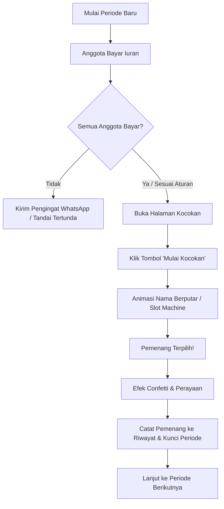
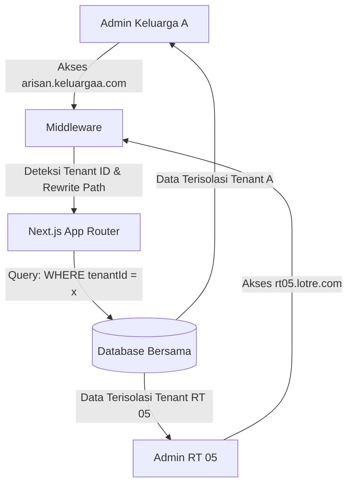
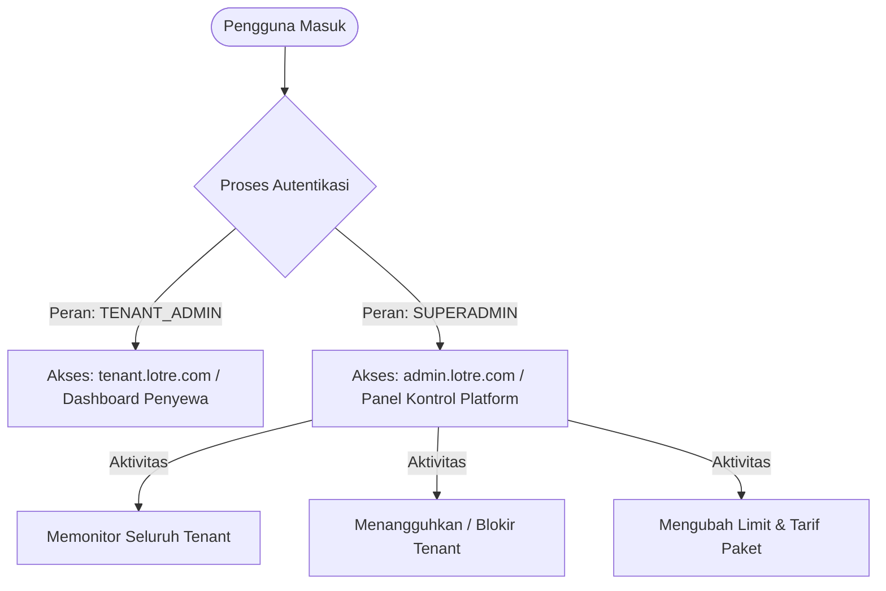
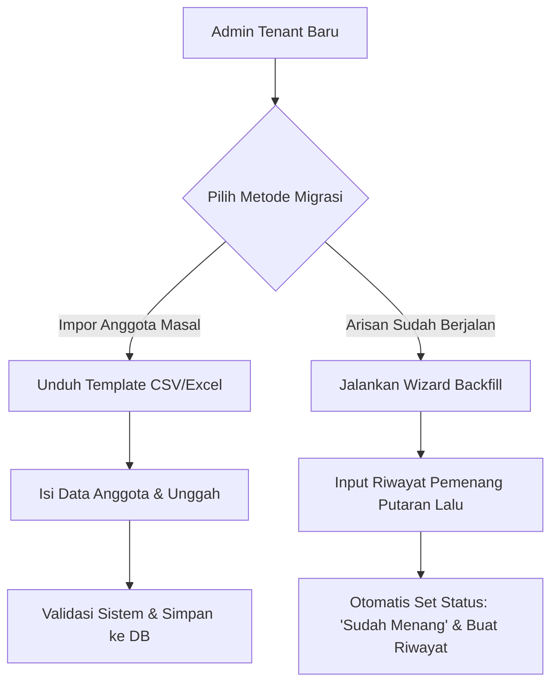

# Rancangan Sistem Informasi Arisan Digital (Lotre)

Dokumen ini berisi rancangan arsitektur, fitur, alur kerja, dan struktur data untuk **Sistem Informasi Arisan** (Lotre) yang dibangun menggunakan **Next.js (App Router)** dan **Vanilla CSS**.

---

## 1. Deskripsi Umum
**Lotre** adalah platform digital untuk mengelola kegiatan arisan secara transparan, modern, dan interaktif. Sistem ini menggantikan pencatatan manual buku kas arisan dan kocokan kertas konvensional dengan sistem kocokan digital interaktif yang dilengkapi efek visual premium (*micro-animations* & *confetti*).

---

## 2. Kebutuhan Fungsional (Fitur Utama)

Sistem akan memiliki 4 modul utama:

### A. Dashboard & Statistik Ringkas
- Menampilkan ringkasan data arisan:
  - Total anggota aktif.
  - Jumlah nominal kas yang terkumpul pada periode berjalan.
  - Anggota yang belum bayar iuran pada periode ini.
  - Nama pemenang arisan periode sebelumnya.
- Grafik progress putaran arisan (misal: Putaran ke-3 dari 10).

### B. Manajemen Anggota & Kelompok Arisan
- **CRUD Anggota**: Menambah, melihat detail, mengedit, dan menghapus data anggota.
- **Status Keaktifan**: Menandai apakah anggota aktif atau ditangguhkan.
- **Informasi Kontak**: Menyimpan nama, nomor WhatsApp (untuk notifikasi iuran), dan alamat.

### C. Pengelolaan Iuran & Kas (Transaksi)
- **Status Setoran per Periode**: Menampilkan grid status setoran anggota (Lunas / Belum Lunas) pada periode berjalan.
- **Pencatatan Manual**: Admin dapat menandai status setoran anggota secara cepat sekali klik (Fast-check).
- **Riwayat Kas**: Laporan total uang masuk dari setoran anggota.

### D. Kocokan / Undian Arisan Interaktif (Fitur Unggulan)
- **Kocok Digital**: Fitur mengundi pemenang secara acak dari daftar anggota yang **aktif** dan **belum pernah menang** pada putaran saat ini.
- **Visual Kocokan Premium**:
  - Efek tabung putar/slot-machine digital berputar cepat menampilkan nama-nama anggota secara dinamis.
  - Transisi halus dan efek ketegangan sebelum nama pemenang terpilih muncul.
  - Perayaan kemenangan dengan **Confetti Particle Animation** saat pemenang terpilih.
- **Konfirmasi Pemenang**: Otomatis mencatat pemenang ke database riwayat setelah undian sah dilakukan.

### E. Riwayat Pemenang & Laporan
- Daftar pemenang arisan per periode/bulan beserta nominal yang diterima.
- Tanggal undian dilaksanakan.

---

## 3. Alur Kerja Sistem (Workflow)

Berikut adalah diagram alur proses arisan dalam satu periode putaran:



---

## 4. Desain Struktur Data (Skema Relasi)

Sistem ini akan mengelola data dengan skema relasi sebagai berikut:

### 1. Tabel / Skema `Anggota` (Members)
Menyimpan profil dasar peserta arisan.

| Field | Tipe Data | Deskripsi |
| :--- | :--- | :--- |
| `id` | String (UUID) | Primary Key, unik untuk setiap anggota |
| `tenantId` | String | Foreign Key merujuk ke `Tenant(id)` untuk isolasi data SaaS |
| `nama` | String | Nama lengkap anggota |
| `whatsapp` | String | Nomor kontak WhatsApp untuk notifikasi |
| `status` | Enum | `'aktif'` atau `'non-aktif'` (status keaktifan dalam kelompok) |
| `userId` | String (Optional) | Foreign Key merujuk ke `User(id)` jika anggota memiliki hak akses akun untuk login melihat dashboard sendiri |
| `createdAt` | Date | Waktu pendaftaran anggota |

> [!NOTE]
> **Catatan Normalisasi Database vs State Frontend:**
> Pada berkas mockup frontend (`page.tsx`), status pembayaran (`lunas` / `belum-bayar`) diletakkan langsung di dalam objek anggota sebagai penyederhanaan state. Namun dalam skema database relasional ini, status pembayaran secara benar disimpan dalam tabel **`Setoran`** per periode (ter-normalisasi), karena status pembayaran bersifat dinamis pada tiap putaran sedangkan profil anggota bersifat statis.

### 2. Tabel / Skema `Setoran` (Payments)
Mencatat pembayaran iuran anggota per periode putaran.

| Field | Tipe Data | Deskripsi |
| :--- | :--- | :--- |
| `id` | String (UUID) | Primary Key |
| `tenantId` | String | Foreign Key merujuk ke `Tenant(id)` |
| `anggotaId` | String | Foreign Key merujuk ke `Anggota(id)` |
| `periodeKe` | Integer | Putaran/periode arisan (contoh: periode 1, 2, dst.) |
| `nominal` | Decimal/Number | Jumlah iuran yang dibayarkan |
| `status` | Enum | `'lunas'` atau `'belum-bayar'` |
| `tanggalBayar`| Date (Optional) | Tanggal pembayaran dilakukan (bernilai `null` jika status masih `'belum-bayar'`) |

### 3. Tabel / Skema `Pemenang` (Winners)
Mencatat hasil kocokan arisan yang sah.

| Field | Tipe Data | Deskripsi |
| :--- | :--- | :--- |
| `id` | String (UUID) | Primary Key |
| `tenantId` | String | Foreign Key merujuk ke `Tenant(id)` |
| `anggotaId` | String | Foreign Key merujuk ke `Anggota(id)` |
| `periodeKe` | Integer | Putaran keberapa arisan dimenangkan |
| `tanggalMenang`| Date | Tanggal kocokan dimenangkan |
| `totalDiterima`| Decimal/Number | Jumlah total uang kas yang diterima pemenang |

---

## 5. Konsep Desain UI/UX (Aesthetics & Premium feel)

Untuk memukau pengguna saat pertama kali mengakses, antarmuka dirancang dengan gaya **Modern Glassmorphism & High-Contrast Dark Mode**:

1. **Tema Warna**:
   - Background utama: Deep Slate (#0b0f19) dengan aksen gradasi lingkaran oranye & ungu blur halus di latar belakang.
   - Warna Utama (Primary): Vibrant Emerald (#10b981) untuk tombol sukses & status Lunas.
   - Warna Aksen (Accent): Royal Violet (#8b5cf6) untuk tombol Kocokan & area Interaktif.

2. **Tipografi Modern**:
   - Menggunakan Google Fonts **Outfit** atau **Inter** untuk teks yang tajam, premium, dan mudah dibaca.

3. **Efek Glassmorphism**:
   - Semua kartu dashboard dan tabel anggota menggunakan background semi-transparan (`rgba(255, 255, 255, 0.05)`) dengan filter `backdrop-filter: blur(12px)` dan border tipis mengkilap (`1px solid rgba(255, 255, 255, 0.1)`).

4. **Animasi & Interaksi Mikro**:
   - Hover efek yang hidup (tombol sedikit membesar, bersinar pelan/glow, dan bayangan dinamis).
   - Efek kocokan nama menggunakan dynamic custom keyframes berputar cepat dan melambat secara elastis (cubic-bezier) hingga berhenti pada nama pemenang.

---

## 6. Persiapan Progressive Web App (PWA) untuk Pengguna Mobile

Mengingat sebagian besar pengguna dan admin arisan akan mengakses aplikasi ini melalui handphone (HP), sistem dipersiapkan agar dapat diinstal dan dijalankan layaknya aplikasi mobile native melalui teknologi **PWA (Progressive Web App)**.

### A. Konfigurasi Web App Manifest (`manifest.json`)
Aplikasi harus menyertakan manifest file di folder `public` dengan spesifikasi berikut:
- **`name`**: `Lotre - Sistem Informasi Arisan Digital`
- **`short_name`**: `Lotre`
- **`start_url`**: `/`
- **`display`**: `standalone` (menghilangkan bar navigasi browser untuk nuansa aplikasi asli/native)
- **`orientation`**: `portrait` (mengunci tampilan potret yang ramah HP)
- **`background_color`**: `#0b0f19` (menghindari kedipan layar putih saat loading)
- **`theme_color`**: `#8b5cf6` (mewarnai status bar HP pengguna dengan warna aksen Violet kita)
- **`icons`**: Menyediakan ikon berkualitas tinggi dengan ukuran `192x192` dan `512x512` piksel dalam format PNG.

### B. Service Worker & Offline Capability
- Menggunakan library Next.js PWA (seperti `@ducanh2912/next-pwa` atau custom service worker) untuk menangani caching aset statis (CSS, Fonts, JS).
- **Layar Offline Kustom**: Jika koneksi terputus, aplikasi tidak akan crash/menampilkan error browser standar, melainkan menampilkan halaman offline yang elegan yang menyatakan koneksi internet terputus namun data lokal tetap aman dibaca.

### C. Desain Mobile-First & Aksesibilitas HP
- **Touch Targets**: Semua tombol interaktif, checkbox, dan link navigasi wajib memiliki ukuran minimal `48px x 48px` untuk mencegah salah klik oleh jari pengguna.
- **Viewport Anti-Cut**: Menggunakan unit CSS modern `100dvh` (Dynamic Viewport Height) alih-alih `100vh` agar tata letak tidak terpotong oleh address bar browser mobile yang dinamis.
- **Pencegahan Zoom Otomatis**: Mengoptimalkan form input agar tidak terjadi auto-zoom yang mengganggu di Safari iOS saat berinteraksi dengan kolom input (`font-size` minimal `16px`).
- **Touch Feedback**: Efek hover pada desktop digantikan dengan efek tekan aktif (`:active`) yang responsif secara taktil di HP.

---

## 7. Arsitektur SaaS Multi-Tenant (Sistem Informasi Skala Bisnis)

Sistem dirancang untuk mendukung model **SaaS (Software-as-a-Service) Multi-Tenant**, memungkinkan ribuan kelompok arisan independen (Tenant) mendaftar dan menggunakan aplikasi ini secara terpisah pada satu infrastruktur yang sama dengan isolasi data yang ketat.

### A. Model Multi-Tenancy: Shared Database, Shared Schema (Logical Isolation)
Untuk efisiensi biaya infrastruktur dan kecepatan skalabilitas, kita menggunakan model **Shared Database & Shared Schema**. Isolasi data dilakukan secara logis menggunakan kolom `tenantId` pada setiap baris data transaksi dan profil.



### B. Penambahan Skema Database untuk Multi-Tenant

#### 1. Tabel `Tenant` (Organisasi / Kelompok Arisan Induk)
Menyimpan data identitas kelompok penyewa jasa arisan SaaS.

| Field | Tipe Data | Deskripsi |
| :--- | :--- | :--- |
| `id` | String (UUID) | Primary Key, unik untuk setiap tenant |
| `namaGrup` | String | Nama kelompok arisan utama (contoh: "Arisan Keluarga Cemara") |
| `slug` | String | Slug unik untuk subdomain/path routing (contoh: `keluarga-cemara`) |
| `plan` | Enum | `'free'` (maks 10 anggota) atau `'premium'` (anggota tak terbatas) |
| `ownerId` | String | ID User Admin yang mendaftar dan memegang hak tagihan |
| `createdAt` | Date | Waktu pendaftaran organisasi |

#### 2. Modifikasi Tabel Eksisting (Isolasi Tenant)
Setiap tabel yang berisi data anggota, pembayaran, dan pemenang wajib ditambahkan field **`tenantId`** untuk mempartisi data:

- **Tabel `Anggota`**: ditambahkan field `tenantId` (Foreign Key -> `Tenant(id)`)
- **Tabel `Setoran`**: ditambahkan field `tenantId` (Foreign Key -> `Tenant(id)`)
- **Tabel `Pemenang`**: ditambahkan field `tenantId` (Foreign Key -> `Tenant(id)`)

> [!WARNING]
> **Indeks Keamanan Database**
> Wajib menambahkan Composite Index pada database untuk mempercepat query pencarian data, contohnya indeks gabungan antara `(tenantId, id)` dan `(tenantId, status)`.

### C. Mekanisme Routing Multi-Tenant di Next.js (Subdomain & Path)
Aplikasi mendukung dua opsi routing untuk setiap tenant:
1. **Path-Based Routing** (Default): `lotre.com/t/keluarga-cemara`
2. **Subdomain-Based Routing** (Premium): `keluarga-cemara.lotre.com`

#### Next.js Middleware (`src/middleware.ts`)
Middleware akan mendeteksi subdomain dari request URL dan melakukan penulisan ulang path internal (rewrite) tanpa merubah URL di browser pengguna:

```typescript
// Konsep Middleware Next.js untuk Multi-Tenancy
import { NextResponse } from 'next/server';
import type { NextRequest } from 'next/server';

export function middleware(request: NextRequest) {
  const hostname = request.headers.get('host') || '';
  const url = request.nextUrl.clone();
  
  // Deteksi subdomain (abaikan www, localhost, dll)
  const subdomain = hostname.split('.')[0];
  const isMainDomain = 
    hostname === 'lotre.com' || 
    hostname.startsWith('localhost') || 
    subdomain === 'www';
  
  if (!isMainDomain && subdomain) {
    // Lakukan rewrite internal ke folder dinamis [tenant]
    url.pathname = `/_tenants/${subdomain}${url.pathname}`;
    return NextResponse.rewrite(url);
  }
  
  return NextResponse.next();
}
```

### D. Keamanan Data (Security Tenant Isolation)
Untuk mencegah kebocoran data antar-tenant (*Cross-Tenant Data Leakage*):
1. **Repository-Level Middleware**: Setiap transaksi data di server-side (ORM seperti Prisma atau direct database query) wajib dibungkus dalam fungsi global yang menginjeksikan parameter `tenantId` secara otomatis berdasarkan sesi login admin.
2. **Row-Level Security (RLS)**: Jika menggunakan PostgreSQL/Supabase, aktifkan fitur Row-Level Security dengan kebijakan (`Policy`):
   ```sql
    CREATE POLICY tenant_isolation_policy ON anggota
    FOR ALL USING (tenant_id = current_setting('app.current_tenant_id'));
    ```

---

## 8. Modul Superadmin (Platform Monitoring & Tenant Management)

Untuk memonitor kinerja bisnis SaaS, mengelola penyewa, dan mengonfigurasi parameter platform secara terpusat, sistem menyediakan panel khusus **Superadmin** yang terisolasi dari panel penyewa (tenant).

### A. Peran & Kontrol Akses (Role-Based Access Control)
Sistem membedakan pengguna menjadi dua peran utama di tingkat gerbang autentikasi:
- **`TENANT_ADMIN`**: Pengguna yang menyewa platform dan mengelola satu kelompok arisan (Tenant) sendiri.
- **`SUPERADMIN`**: Pemilik platform (SaaS Provider) yang memiliki wewenang penuh atas seluruh infrastruktur, database, dan lisensi penyewa.



### B. Penambahan & Penyesuaian Skema Database

#### 1. Tabel `User` (Autentikasi Pusat)
Mengelola kredensial masuk admin tenant dan superadmin.

| Field | Tipe Data | Deskripsi |
| :--- | :--- | :--- |
| `id` | String (UUID) | Primary Key |
| `email` | String | Email unik untuk login |
| `passwordHash` | String | Password yang dienkripsi (bcrypt/argon2) |
| `namaLengkap` | String | Nama lengkap pemilik akun |
| `role` | Enum | `'SUPERADMIN'`, `'TENANT_ADMIN'`, atau `'MEMBER'` |
| `createdAt` | Date | Waktu pendaftaran akun |

#### 2. Modifikasi Tabel `Tenant` (Menambahkan Status Tenant)
Superadmin membutuhkan kontrol penuh terhadap keaktifan penyewa berdasarkan status pembayaran/kepatuhan hukum.

| Field Baru | Tipe Data | Deskripsi |
| :--- | :--- | :--- |
| `status` | Enum | `'active'` (aktif normal), `'suspended'` (diblokir/ditangguhkan), `'pending'` (menunggu verifikasi email) |
| `suspendReason` | String (Optional) | Catatan/alasan penangguhan jika tenant diblokir |

---

### C. Fitur Utama Panel Superadmin (`/superadmin`)

#### 1. Dashboard Analitik Global (Global Analytics)
Menampilkan matriks agregat dari seluruh platform secara real-time untuk memantau kesehatan bisnis:
- **Total Registrasi Tenant**: Jumlah grup arisan yang terdaftar (dipecah berdasarkan paket Free vs Premium).
- **Total Pengguna Aktif**: Gabungan seluruh anggota arisan di platform.
- **Pendapatan SaaS**: Total nilai transaksi tagihan berlangganan premium yang berhasil dikumpulkan.
- **Tingkat Aktivitas Kocokan**: Jumlah kocokan arisan yang sukses dijalankan hari ini di seluruh tenant.

#### 2. Manajemen Tenant Terpusat (Tenant Control Console)
Tabel interaktif dengan pencarian cepat untuk memantau performa masing-masing penyewa:
- **Filter Status & Paket**: Mencari tenant berdasarkan status (`active`/`suspended`) atau paket (`free`/`premium`).
- **Tindakan Suspend / Aktivasi**: Tombol sekali klik untuk menangguhkan tenant yang melanggar aturan atau terlambat membayar iuran SaaS. Jika ditangguhkan, seluruh admin tenant dan anggota di subdomain tersebut akan diarahkan ke halaman error "Tenant Ditangguhkan".
- **Upgrade/Downgrade Paket Manual**: Memungkinkan superadmin memberikan paket premium gratis untuk tujuan promosi/kemitraan.

#### 3. Konfigurasi Global Platform (Global System Settings)
Superadmin dapat mengubah parameter sistem secara dinamis tanpa perlu melakukan deploy ulang kode:
- **Limit Anggota Paket Free**: Mengatur batas jumlah anggota maksimal pada paket gratis (misal: default 10 anggota).
- **Tarif Paket Berlangganan**: Mengubah nominal biaya berlangganan bulanan untuk paket Premium.

#### 4. Pengumuman Sistem Global (Broadcast Engine)
- Fitur untuk mengirimkan pengumuman darurat atau informasi pemeliharaan server (*maintenance warning banner*) yang akan otomatis muncul di bagian atas dashboard seluruh `TENANT_ADMIN`.

---

### D. Keamanan Rute & Shielding Middleware

Seluruh rute panel kontrol superadmin diletakkan di bawah direktori `/superadmin/*` (Next.js App Router: `app/superadmin/...`) dan dilindungi secara ketat di tingkat Next.js Middleware:

```typescript
// Tambahan Validasi Peran di src/middleware.ts
import { getToken } from 'next-auth/jwt';
import { NextResponse } from 'next/server';
import type { NextRequest } from 'next/server';

export async function middleware(request: NextRequest) {
  const url = request.nextUrl.clone();
  
  // Jika mengakses rute superadmin
  if (url.pathname.startsWith('/superadmin')) {
    const token = await getToken({ req: request });
    
    // Blokir jika tidak memiliki sesi aktif atau peran bukan SUPERADMIN
    if (!token || token.role !== 'SUPERADMIN') {
      url.pathname = '/auth/login'; // Alihkan ke halaman masuk
      return NextResponse.redirect(url);
    }
  }
  
  return NextResponse.next();
}
```

---

## 9. Konsep Migrasi & Portabilitas Data (Data Migration & Portability)

Untuk mempermudah kelompok arisan baru bermigrasi ke platform **Lotre** tanpa kehilangan data historis mereka, serta memastikan transparansi kepemilikan data (data ownership), sistem menyediakan modul **Migrasi dan Portabilitas Data**.

### A. Migrasi Data Onboarding (Legacy-to-Cloud Migration)

Sebagian besar kelompok arisan baru saat mendaftar biasanya memiliki data anggota yang tersimpan di spreadsheet (Excel/CSV), grup WhatsApp, atau buku kas manual. Sistem menyediakan dua metode migrasi otomatis:



#### 1. Impor Massal Anggota (Bulk Import via Excel/CSV)
- **Unduh Template**: Sistem menyediakan template berkas `.csv` atau `.xlsx` terstandar dengan kolom: `Nama Lengkap`, `No. WhatsApp (Format Internasional)`, dan `Status Keaktifan`.
- **Parsing Server-Side**: Berkas diunggah oleh admin, lalu Next.js API Route memproses berkas tersebut (menggunakan library `papaparse` untuk CSV atau `xlsx` untuk Excel).
- **Transaksi Database Aman (Atomic Transaction)**: Pengisian data anggota ke database dijalankan di dalam satu database transaction. Jika terjadi kegagalan format pada baris ke-50, sistem akan melakukan *rollback* penuh untuk mencegah data tersimpan sebagian (*partial corruption*):
  ```typescript
  // Konsep Atomic Transaction untuk Bulk Import Anggota
  await prisma.$transaction(
    membersArray.map((member) => 
      prisma.anggota.create({
        data: {
          tenantId: activeTenantId,
          nama: member.name,
          whatsapp: member.phone,
          status: 'aktif',
          hasWon: false
        }
      })
    )
  );
  ```

#### 2. Wizard Backfill Putaran Berjalan (Ongoing Arisan Backfill Wizard)
Sering kali, kelompok arisan bermigrasi ke **Lotre** ketika putaran arisan mereka **sedang berjalan** (misalnya, sudah memasuki bulan ke-5 dari total 12 bulan).
Sistem menyediakan antarmuka konfigurasi awal (Onboarding Wizard):
- **Set Periode Awal**: Admin memasukkan informasi putaran saat ini (contoh: "Arisan berjalan sudah masuk periode ke-5").
- **Backfill Pemenang Masa Lalu**: Sistem meminta admin mengisi siapa saja pemenang pada Periode 1, 2, 3, dan 4 beserta nominal yang mereka terima dan tanggal undiannya.
- **Efek Sistem**:
  - Sistem otomatis membuat 4 rekaman historis di tabel `Pemenang`.
  - Anggota yang dimasukkan sebagai pemenang masa lalu otomatis ditandai statusnya menjadi `hasWon = true` sehingga mereka **tidak akan diikutkan** dalam kocokan digital berikutnya di Periode 5.
  - Statistik total kas terdistribusi di dashboard akan langsung akurat mencerminkan kondisi riil arisan.

---

### B. Migrasi Skema Database (Database Evolution Migrations)

Seiring berkembangnya fitur SaaS (seperti penambahan kolom baru atau perubahan tipe data), migrasi skema database harus berjalan tanpa menyebabkan kegagalan sistem (*zero-downtime database migration*):
1. **Version-Controlled Migrations**: Menggunakan ORM tool seperti **Prisma Migrate** (`prisma migrate dev`). Setiap perubahan skema dideklarasikan dalam berkas SQL migrasi yang tercatat di repositori Git.
2. **Backward Compatibility**: Saat melakukan migrasi database (misalnya menambahkan field `tenantId`), database wajib di-set dengan nilai default terlebih dahulu atau melalui proses *double-write phase* agar aplikasi lama tetap dapat berjalan saat proses migrasi data berlangsung di latar belakang.

---

### C. Portabilitas & Ekspor Data (Exit Strategy & Data Ownership)

Sesuai standar SaaS modern dan kepatuhan privasi data, penyewa (Tenant) memiliki hak penuh atas data mereka dan tidak boleh dikunci di dalam platform (*no vendor lock-in*).

- **Ekspor Data Mandiri**: Admin Tenant dapat mengunduh seluruh data mereka kapan saja melalui tombol *Ekspor Data* di pengaturan tenant.
- **Format Ekspor**: Data diekspor dalam bentuk arsip `.zip` berisi:
  - `anggota.csv`: Daftar seluruh anggota dan kontaknya.
  - `iuran_transaksi.csv`: Seluruh riwayat pembayaran anggota dari periode awal hingga sekarang.
  - `riwayat_pemenang.csv`: Daftar lengkap pemenang per periode.
  - `backup_data.json`: Berkas berstruktur JSON lengkap jika penyewa ingin memigrasikan datanya ke aplikasi arisan lain atau menyimpannya sebagai cadangan offline pribadi.

